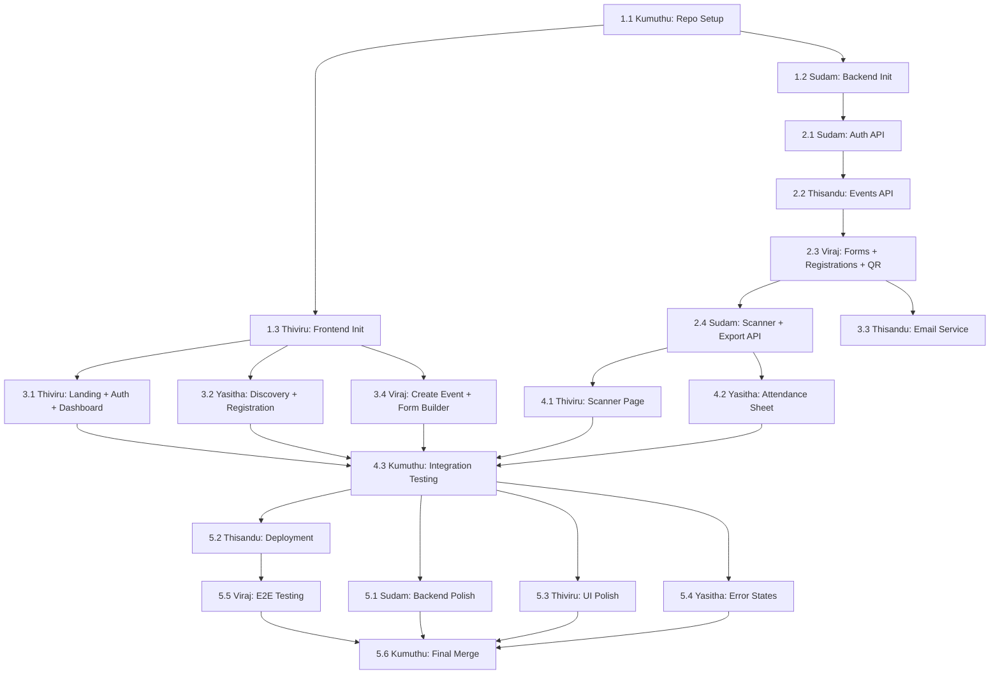

# NexAttend Events — 2-Day Development Plan

## 📅 Sprint Schedule

**Duration:** 2 Days (March 19-20, 2026)
**Team:** Kumuthu (Lead), Thiviru (Frontend Lead), Yasitha (Frontend), Sudam (Backend Lead), Thisandu (Backend), Viraj (Backend + Services)
**Blueprint Reference:** Read `NexAttend-Events-Blueprint.md` for ALL technical details (schemas, API contracts, code patterns).

> **IMPORTANT FOR AI AGENTS:** Before implementing ANY task, read `NexAttend-Events-Blueprint.md` first. It contains the exact database schemas, API request/response formats, project structure, .gitignore, requirements.txt, package.json, and code patterns.

---

# 🟦 DAY 1 — Foundation + Core Features

**Goal:** By end of Day 1, the entire backend API should be functional, and the frontend should have all pages with UI complete and connected to the backend.

---

## Phase 1: Project Setup (MUST DO FIRST — All Members)

> ⏰ **Morning — First 1-2 hours**
> These tasks MUST be done sequentially. Kumuthu sets up the repo first, then Sudam and Thiviru initialize their projects, then everyone pulls and starts.

### Task 1.1 — Kumuthu: Repository & Project Setup

**Order:** 🥇 FIRST (everyone depends on this)
**Branch:** `main`

**What to do:**
1. Create a new GitHub repository called `NexAttend-Events`
2. Create the `.gitignore` file (copy exact content from Blueprint Section 4)
3. Create the root `README.md` with project title and description
4. Create the `vercel.json` in root (copy from Blueprint Section 14)
5. Create the `docs/` folder
6. Copy `NexAttend-Events-Blueprint.md` into `docs/`
7. Copy this day-by-day plan into `docs/`
8. Set branch protection rules on `main` (require PR review)
9. Create `develop` branch
10. Push initial commit

**Deliverable:** Repository ready, all members can clone.

**Files to create:**
```
NexAttend-Events/
├── .gitignore
├── README.md
├── vercel.json
└── docs/
    ├── NexAttend-Events-Blueprint.md
    └── NexAttend-Events-Day-Plan.md
```

---

### Task 1.2 — Sudam: Backend Project Initialization

**Order:** 🥈 SECOND (after Kumuthu pushes repo)
**Branch:** `feature/backend/project-setup`
**Depends on:** Task 1.1

**What to do:**
1. Pull the repo
2. Create the entire `backend/` folder structure (see Blueprint Section 3)
3. Create `backend/requirements.txt` (copy exact content from Blueprint Section 5)
4. Create `backend/.env.example` (copy from Blueprint Section 13)
5. Create Python virtual environment: `python -m venv venv`
6. Install dependencies: `pip install -r requirements.txt`
7. Create `backend/app/__init__.py` (empty)
8. Create `backend/app/main.py` (copy the FastAPI main app pattern from Blueprint Section 15)
9. Create `backend/app/core/__init__.py` (empty)
10. Create `backend/app/core/config.py`:
    ```python
    from pydantic_settings import BaseSettings
    
    class Settings(BaseSettings):
        MONGODB_URL: str
        DATABASE_NAME: str = "nexattend_events_db"
        MONGODB_TLS: bool = True
        SECRET_KEY: str
        JWT_SECRET: str
        JWT_ALGORITHM: str = "HS256"
        ACCESS_TOKEN_EXPIRE_MINUTES: int = 1440
        SENDGRID_API_KEY: str = ""
        SENDGRID_FROM_EMAIL: str = "noreply@nexattend-events.com"
        HOST: str = "0.0.0.0"
        PORT: int = 8000
    
        class Config:
            env_file = ".env"
    
    settings = Settings()
    ```
11. Create `backend/app/core/security.py`:
    - `hash_password(password: str) -> str` (bcrypt)
    - `verify_password(plain, hashed) -> bool`
    - `create_access_token(data: dict) -> str` (JWT)
    - `decode_access_token(token: str) -> dict`
12. Create `backend/app/database/__init__.py` (empty)
13. Create `backend/app/database/mongodb.py`:
    - `connect_db()` — connect using Motor async driver
    - `close_db()` — close connection
    - `get_database()` — return database instance
    - Use the EXACT same pattern as NexAttend's `mongodb.py`
14. Create all `__init__.py` files in `models/`, `schemas/`, `services/`, `api/`, `api/routes/`
15. Create `backend/app/api/deps.py`:
    - `get_current_user()` dependency — decode JWT from Authorization header
    - `get_db()` dependency — return database instance
16. Create `backend/data/exports/.gitkeep`
17. Test: `uvicorn app.main:app --reload` should start without errors
18. Push and create PR

**Deliverable:** FastAPI server starts on `localhost:8000`, empty route handlers imported.

---

### Task 1.3 — Thiviru: Frontend Project Initialization

**Order:** 🥈 SECOND (after Kumuthu pushes repo, can be parallel with Sudam)
**Branch:** `feature/frontend/project-setup`
**Depends on:** Task 1.1

**What to do:**
1. Pull the repo
2. Create React + TypeScript project: `npx -y create-vite@latest web -- --template react-ts` (or initialize in `web/` folder)
3. Install all dependencies from Blueprint Section 6:
   ```bash
   cd web
   npm install axios framer-motion html5-qrcode lucide-react qrcode.react react-router-dom recharts
   npm install -D @tailwindcss/postcss autoprefixer postcss tailwindcss
   ```
4. Configure Tailwind CSS (postcss.config.js, index.css with `@import "tailwindcss"`)
5. Create `web/.env.example`: `VITE_API_URL=http://localhost:8000`
6. Create the folder structure:
   ```
   web/src/
   ├── components/
   ├── pages/
   ├── contexts/
   ├── services/
   └── utils/
   ```
7. Create `web/src/services/api.ts` (copy the FULL API service from Blueprint Section 15)
8. Create `web/src/contexts/AuthContext.tsx`:
   - Store user state + token in context
   - `login()`, `register()`, `logout()` functions
   - Auto-load user from localStorage on mount
   - `ProtectedRoute` component that redirects to `/login` if not authenticated
9. Create `web/src/App.tsx` with all routes (copy routing map from Blueprint Section 11)
   - For now, each page can be a placeholder `<div>Page Name</div>`
10. Set up the NexAttend-inspired dark theme in `index.css`:
    - Dark navy background (`#0a0a1a` or similar)
    - Cyan accent (`#00d4ff`)
    - Purple accent (`#7c3aed`)
    - Glassmorphism card styles
    - Import Inter font from Google Fonts
11. Test: `npm run dev` should start and show routing working
12. Push and create PR

**Deliverable:** React app runs, routing works, all placeholder pages accessible.

---

## Phase 2: Backend API Development (Day 1 — After Setup)

> ⏰ **Day 1 — After Phase 1 is done**
> Sudam, Thisandu, and Viraj work on backend endpoints. These should be developed in this ORDER because of dependencies.

### Task 2.1 — Sudam: Auth API + User Model

**Order:** 🥇 FIRST backend task (others depend on auth working)
**Branch:** `feature/backend/auth`
**Depends on:** Task 1.2

**What to do:**
1. Create `backend/app/models/user.py`:
   - Define the user document structure (see Blueprint Section 7 — `users` collection)
   - Helper functions: `create_user()`, `get_user_by_email()`, `get_user_by_id()`
2. Create `backend/app/schemas/user.py`:
   - `UserRegisterRequest`: name, email, password, organization (optional)
   - `UserLoginRequest`: email, password
   - `UserResponse`: id, name, email, organization, created_at
   - `TokenResponse`: id, name, email, token
3. Create `backend/app/api/routes/auth.py`:
   - `POST /register` — validate input, check email uniqueness, hash password, save to DB, return JWT
   - `POST /login` — verify credentials, return JWT
   - `GET /me` — return current user (requires auth)
4. Create `backend/app/api/routes/health.py`:
   - `GET /health` — return `{ "status": "ok", "database": "connected" }`
5. Register routers in `backend/app/api/routes/__init__.py`
6. Test all 3 auth endpoints with Swagger UI (`/docs`)
7. Push and create PR

**Deliverable:** Auth fully working — register, login, /me with JWT.

---

### Task 2.2 — Thisandu: Events API + Event Model

**Order:** 🥈 SECOND backend task (forms depend on events existing)
**Branch:** `feature/backend/events`
**Depends on:** Task 2.1 (needs auth middleware)

**What to do:**
1. Create `backend/app/models/event.py`:
   - Define event document structure (see Blueprint Section 7 — `events` collection)
   - Helper functions: `create_event()`, `get_events_by_creator()`, `get_event_by_id()`, `get_event_by_slug()`, `update_event()`, `delete_event()`
   - `generate_slug(title)` function — lowercase, replace spaces with hyphens, append random 4 chars if duplicate
2. Create `backend/app/schemas/event.py`:
   - `EventCreateRequest`: title, description, event_date, location, capacity, category, cover_image_url
   - `EventUpdateRequest`: same but all optional
   - `EventResponse`: all fields including id, slug, status, registration_count, checked_in_count
   - `EventListResponse`: list of EventResponse
   - `EventPublicResponse`: subset for public discovery (no internal fields)
3. Create `backend/app/api/routes/events.py`:
   - `POST /events` — create event (auth required), auto-generate slug, set status="draft"
   - `GET /events` — get all events for current user (auth required)
   - `GET /events/:id` — get single event (auth required, must be creator)
   - `PUT /events/:id` — update event (auth required, must be creator)
   - `DELETE /events/:id` — delete event (auth required, must be creator)
   - `PATCH /events/:id/status` — update status: draft/published/ongoing/completed
   - `GET /events/public/discover` — search published events (NO auth, query params: search, category)
   - `GET /events/public/:slug` — get event by slug (NO auth, for registration page)
4. Create database indexes for events collection (see Blueprint Section 7)
5. Test all endpoints with Swagger UI
6. Push and create PR

**Deliverable:** Full Event CRUD working, public discovery search working.

---

### Task 2.3 — Viraj: Form Fields API + Registration API + QR Service

**Order:** 🥉 THIRD backend task (registrations depend on events + form fields)
**Branch:** `feature/backend/forms-registrations`
**Depends on:** Task 2.2 (needs events to exist)

**What to do:**

**Part A — Form Fields:**
1. Create `backend/app/models/form_field.py`:
   - Define form_field document structure (see Blueprint Section 7)
   - Helper functions: `create_field()`, `get_fields_by_event()`, `update_field()`, `delete_field()`, `create_default_fields(event_id)`
   - `create_default_fields()` should create: Full Name (text, required, order:1), Email (email, required, order:2), Phone Number (phone, required, order:3)
2. Create `backend/app/schemas/form_field.py`:
   - `FormFieldCreateRequest`: label, field_type, placeholder, required, order, options
   - `FormFieldResponse`: all fields including id
3. Create `backend/app/api/routes/forms.py`:
   - `GET /events/:event_id/fields` — get all fields (NO auth — participants need this)
   - `POST /events/:event_id/fields` — add field (auth required)
   - `PUT /events/:event_id/fields/:field_id` — update field (auth required)
   - `DELETE /events/:event_id/fields/:field_id` — delete field (auth required)
   - `PUT /events/:event_id/fields/reorder` — reorder fields (auth required)
4. **IMPORTANT:** When an event is created (in Task 2.2's create endpoint), also call `create_default_fields(event_id)`. Coordinate with Thisandu to add this call in the event creation flow.

**Part B — QR Service:**
5. Create `backend/app/services/qr_service.py`:
   - `generate_qr_code_id(event_id, registration_id) -> str` — format: `EVT-{first6}-REG-{first6}`
   - `generate_qr_image(qr_code_id: str) -> str` — return base64 PNG string
   - Use the Python `qrcode` library (see Blueprint Section 12 for exact code)

**Part C — Registrations:**
6. Create `backend/app/models/registration.py`:
   - Define registration document structure (see Blueprint Section 7)
   - Helper functions: `create_registration()`, `get_registrations_by_event()`, `get_registration_by_qr_code_id()`, `mark_checked_in()`, `check_duplicate(event_id, email)`
7. Create `backend/app/schemas/registration.py`:
   - `RegistrationCreateRequest`: event_id, form_data (dict)
   - `RegistrationResponse`: id, qr_code_id, qr_code_base64, event_title, registered_at
   - `RegistrationListResponse`: list with all form_data + status
8. Create `backend/app/api/routes/registrations.py`:
   - `POST /registrations` — register for event (NO auth — public):
     1. Validate event exists and is published
     2. Check capacity (registration_count < capacity)
     3. Extract email from form_data and check for duplicate
     4. Create registration document
     5. Generate qr_code_id and qr_image
     6. Increment event's registration_count
     7. Return registration with QR code base64
   - `GET /events/:event_id/registrations` — get all registrations (auth required)
   - `GET /registrations/:qr_code_id` — get by QR code ID (NO auth — for verification)
9. Create database indexes for registrations collection
10. Test full flow: create event → add fields → register participant → get QR
11. Push and create PR

**Deliverable:** Form fields CRUD working, participant registration working, QR codes generating.

---

### Task 2.4 — Sudam: Scanner API + Export API

**Order:** 4th backend task (after registrations exist)
**Branch:** `feature/backend/scanner-export`
**Depends on:** Task 2.3 (needs registrations to exist)

**What to do:**

**Part A — Scanner:**
1. Create `backend/app/schemas/scanner.py`:
   - `ScanRequest`: qr_code_id
   - `ScanResponse`: status, participant (dict), checked_in_at, message
2. Create `backend/app/api/routes/scanner.py`:
   - `POST /scanner/check-in` — (auth required):
     1. Look up registration by qr_code_id
     2. If not found → 404 "No registration found"
     3. If already checked_in → 200 with status "already_checked_in" and original timestamp
     4. If not checked in → update to checked_in=true, set checked_in_at, increment event's checked_in_count → 200 with status "checked_in"
   - `GET /scanner/verify/:qr_code_id` — check registration without marking (auth required)

**Part B — Export:**
3. Create `backend/app/services/export_service.py`:
   - `generate_csv(registrations, form_fields) -> StringIO` (see Blueprint Section 15 for exact code)
   - `generate_excel(registrations, form_fields, event_title) -> BytesIO` (see Blueprint Section 15 for exact code)
4. Create `backend/app/api/routes/export.py`:
   - `GET /export/:event_id/csv` — (auth required):
     1. Get event (verify creator)
     2. Get form fields for event
     3. Get registrations (apply status filter if provided)
     4. Generate CSV using export_service
     5. Return as StreamingResponse with filename `{event_title}_attendance.csv`
   - `GET /export/:event_id/excel` — same but Excel:
     1. Generate Excel using export_service
     2. Return as StreamingResponse with filename `{event_title}_attendance.xlsx`
5. Test scanner: create registration → scan QR → verify check-in → scan again (should show "already checked in")
6. Test export: register 3-5 participants → download CSV → verify data
7. Push and create PR

**Deliverable:** Scanner check-in working (with duplicate detection), CSV + Excel export working.

---

## Phase 3: Frontend Pages (Day 1 — Parallel with Backend)

> ⏰ **Day 1 — After Phase 1, parallel with Phase 2**
> Thiviru and Yasitha build the frontend pages. They can use mock data initially and connect to real API as backend endpoints become available.

### Task 3.1 — Thiviru: Landing Page + Auth Pages + Dashboard

**Order:** Start immediately after Task 1.3
**Branch:** `feature/frontend/core-pages`
**Depends on:** Task 1.3

**What to do:**

**Part A — Landing Page (`LandingPage.tsx`):**
1. Create a stunning dark-themed landing page inspired by NexAttend
2. **Nav bar:** Logo "NexAttend Events" (styled with cyan gradient), links: Explore Events, Dashboard, Login
3. **Hero section:**
   - Headline: "Seamless Event Check-In, Powered by QR"
   - Subtitle: "Create events, register participants, scan QR codes, export attendance — all in one platform."
   - Two CTA buttons: "Get Started" (cyan gradient, links to /register) + "Explore Events" (outlined, links to /events)
   - Subtle animated background (particles or gradient mesh)
4. **Features section:** 3 glassmorphism cards with Lucide icons:
   - "Custom Registration Forms" (ClipboardList icon)
   - "Instant QR Codes" (QrCode icon)
   - "One-Click Export" (Download icon)
5. **How It Works:** 4-step visual flow with numbered circles
6. **Footer:** "A sub-project by Team NexAttend" branding
7. Use Framer Motion for scroll animations

**Part B — Auth Pages:**
8. Create `LoginPage.tsx`:
   - Clean, centered card with email + password inputs
   - "Login" button, "Don't have an account? Register" link
   - Connect to AuthContext `login()` function
   - On success → redirect to `/dashboard`
9. Create `RegisterPage.tsx`:
   - Card with: Full Name, Email, Organization, Password, Confirm Password
   - "Create Account" button
   - Connect to AuthContext `register()` function
   - On success → redirect to `/dashboard`

**Part C — Dashboard:**
10. Create `Sidebar.tsx`:
    - Left sidebar with links: Dashboard, Create Event, My Events, Settings
    - NexAttend Events logo at top
    - Active link highlighted with cyan
11. Create `DashboardPage.tsx`:
    - Layout: Sidebar + main content
    - **Stats row:** 4 StatsCard components — Total Events, Active Events, Total Registrations, Total Checked In
    - **My Events grid:** EventCard components showing each event
    - Fetch data from `GET /events` API
12. Create `StatsCard.tsx` component:
    - Glassmorphism card with icon, label, value
    - Animated number counter on load
13. Create `EventCard.tsx` component:
    - Cover image, title, date, status badge (colored), registration count with progress bar
    - Action buttons: Edit, Scanner, Attendance, Delete
    - Used in both Dashboard and Event Discovery

14. Push and create PR

**Deliverable:** Landing page, Login, Register, Dashboard all complete with styling.

---

### Task 3.2 — Yasitha: Event Discovery + Registration + Success Pages

**Order:** Start immediately after Task 1.3 (parallel with Thiviru)
**Branch:** `feature/frontend/participant-pages`
**Depends on:** Task 1.3

**What to do:**

**Part A — Event Discovery:**
1. Create `EventDiscoveryPage.tsx`:
   - **Search bar:** Full-width with search icon, placeholder "Search events by name..."
   - **Category filter tags:** Buttons for All, Hackathon, Workshop, Conference, Seminar
   - **Event cards grid:** 3-column grid (2 on tablet, 1 on mobile) using EventCard component from Thiviru (or create own version)
   - Each card shows: cover image, title, date, location, capacity progress bar ("156/200 spots"), "Register Now" button
   - Fetch from `GET /events/public/discover?search=...&category=...`
   - Debounce search input (300ms delay)

**Part B — Event Registration:**
2. Create `EventRegistrationPage.tsx`:
   - Route: `/events/:slug/register`
   - Fetch event by slug: `GET /events/public/:slug`
   - Fetch form fields: `GET /events/:eventId/fields`
   - **Event header:** Cover image banner, event title, date, location
   - **Dynamic form:** Loop through form_fields and render appropriate input for each field_type:
     - `text` → `<input type="text">`
     - `email` → `<input type="email">`
     - `number` → `<input type="number">`
     - `phone` → `<input type="tel">`
     - `textarea` → `<textarea>`
     - `dropdown` → `<select>` with options
     - `checkbox` → `<input type="checkbox">`
   - Validate required fields before submit
   - On submit: `POST /registrations` with event_id and form_data
   - On success: redirect to `/registration/success/:qrCodeId`

**Part C — Registration Success:**
3. Create `RegistrationSuccessPage.tsx`:
   - Route: `/registration/success/:qrCodeId`
   - **Success animation:** Green checkmark with Framer Motion animate-in
   - **"You're Registered!" heading**
   - **QR Code display:** Use `qrcode.react` (`<QRCodeCanvas>`) to render the QR code large
   - **Details:** Event name, participant name (from form_data), Registration ID
   - **"Download QR Code" button:** Convert QR canvas to PNG and trigger download
   - **"Check your email" reminder** with email icon
4. Create `QRCodeDisplay.tsx` component:
   - Accepts `value` (the qr_code_id string) and `size`
   - Renders `<QRCodeCanvas>` from `qrcode.react`
   - Has a "Download" button that exports the QR as PNG

5. Push and create PR

**Deliverable:** Event discovery with search, registration form (dynamic fields), QR confirmation page.

---

### Task 3.3 — Thisandu: Email Service (Backend)

**Order:** After Task 2.3 (needs registration to trigger emails)
**Branch:** `feature/backend/email`
**Depends on:** Task 2.3

**What to do:**
1. Create `backend/app/services/email_service.py`:
   - `send_registration_email(to_email, participant_name, event_title, event_date, qr_code_id, qr_code_base64)`
   - Use SendGrid API (same pattern as NexAttend)
   - Email contains: event details, participant name, QR code as embedded image
2. Create `backend/app/templates/registration_email.html`:
   - Jinja2 HTML template
   - Professional email design with:
     - Event title and date header
     - "You're registered!" message
     - Participant name
     - QR code image (embedded as CID attachment or base64 inline)
     - "Present this QR code at the event entrance" instruction
     - NexAttend Events branding footer
3. Integrate email sending into the registration endpoint (in `registrations.py`):
   - After successful registration, call `send_registration_email()` in background
   - Set `qr_emailed=True` on registration document
   - Don't let email failure block the registration response — use try/except
4. Test: register for event → check email received with QR code
5. Push and create PR

**Deliverable:** Registration confirmation emails sent automatically with QR code attached.

---

### Task 3.4 — Viraj: Create Event Page + Form Builder (Frontend)

**Order:** After Task 1.3 (parallel with other frontend tasks)
**Branch:** `feature/frontend/create-event`
**Depends on:** Task 1.3

**What to do:**
1. Create `CreateEventPage.tsx`:
   - **Two-column layout:**
   - **Left column — Event Details:**
     - Event Title input
     - Description textarea
     - Event Date datepicker input
     - Event End Date (optional)
     - Location input
     - Capacity number input
     - Category dropdown: Hackathon, Workshop, Conference, Seminar, Other
     - Cover Image upload (convert to base64 or upload to server)
   - **Right column — Form Builder:**
     - Title: "Registration Form Fields"
     - List of existing form field cards (default 3: Name, Email, Phone)
     - Each card shows: label, type badge, required/optional badge, edit icon, delete icon
     - On delete: remove field from list (confirm modal first)
     - On edit: inline edit or modal to change label, type, required, placeholder
     - **"+ Add Field" button** at bottom — opens a modal or inline form:
       - Label input
       - Type dropdown: Text, Email, Number, Phone, Dropdown, Textarea, Checkbox
       - If Dropdown selected → show "Options" input (comma-separated or one per line)
       - Required toggle
       - Save button
     - Drag-to-reorder would be nice but is optional — at minimum, up/down arrow buttons
   - **Bottom bar:** "Save as Draft" button + "Publish Event" button
   - On Save: `POST /events` then `POST /events/:id/fields` for each custom field
   - On Publish: same but set status to "published"
2. Create `FormFieldBuilder.tsx` component:
   - Renders the list of fields with add/edit/delete functionality
   - Manages local state of fields before saving to backend
3. Create `EditEventPage.tsx`:
   - Same as CreateEventPage but pre-populated with existing data
   - Fetch event: `GET /events/:id`
   - Fetch fields: `GET /events/:id/fields`
   - On save: `PUT /events/:id` + update/add/delete fields
4. Push and create PR

**Deliverable:** Create Event page with working form builder, Edit Event page.

---

## Day 1 — End of Day Checklist

- [ ] GitHub repo created and all members have cloned
- [ ] Backend runs on `localhost:8000`
- [ ] Frontend runs on `localhost:5173`
- [ ] Auth works (register, login, JWT)
- [ ] Events CRUD works
- [ ] Form fields CRUD works (default fields auto-created)
- [ ] Participant registration works → QR code returned
- [ ] Scanner check-in works (with duplicate detection)
- [ ] CSV + Excel export works
- [ ] Landing page looks premium (dark theme, animations)
- [ ] Login + Register pages work and connect to API
- [ ] Dashboard shows events and stats
- [ ] Event Discovery page shows published events with search
- [ ] Registration form renders dynamic fields
- [ ] QR confirmation page displays QR code with download button
- [ ] Create Event page with form builder works
- [ ] Email sends with QR (if SendGrid configured)

**Day 1 Target: 5+ commits per person = 30+ total**

---

# 🟩 DAY 2 — Scanner, Polish, Deploy

**Goal:** By end of Day 2, the system is fully working, polished, tested, and deployed.

---

## Phase 4: Scanner + Attendance Sheet (Morning)

### Task 4.1 — Thiviru: QR Scanner Page

**Order:** 🥇 FIRST task Day 2
**Branch:** `feature/frontend/scanner`
**Depends on:** Task 2.4 (scanner API must exist)

**What to do:**
1. Create `QRScanner.tsx` component:
   - Use `html5-qrcode` library (see Blueprint Section 15 for pattern)
   - Initialize camera scanner on mount
   - Call `onScan(decodedText)` callback when QR detected
   - Handle camera permission denial gracefully
   - Clean up scanner on unmount
   - **MUST TEST ON MOBILE BROWSER** — this is critical
2. Create `ScannerPage.tsx`:
   - Route: `/events/:id/scanner`
   - Fetch event details for title and counts
   - **Header:** Event title + Live counter "Checked In: 127 / 200"
   - **Camera viewfinder:** QRScanner component centered on page
   - **Last scan result card:** Shows result of most recent scan:
     - Green card: "✓ John Doe — Checked In at 2:35 PM" (new check-in)
     - Yellow card: "⚠ John Doe — Already checked in at 2:35 PM" (duplicate)
     - Red card: "✗ Invalid QR Code" (not found)
   - **Scan history:** List of last 10 scans with timestamps
   - **"Manual Check-In" button:** Opens modal with search input:
     - Search registrations by name/email
     - Show matching participants
     - Click to manually mark as checked in
   - On each successful scan:
     1. Call `POST /scanner/check-in` with the scanned QR code ID
     2. Play success/error sound (optional)
     3. Show result card
     4. Update live counter
   - **Auto-refocus scanner** after each scan (don't require manual restart)
3. Style for mobile:
   - Camera viewfinder should fill most of the screen
   - Result card visible below viewfinder
   - Large, tappable buttons
4. Push and create PR

**Deliverable:** QR scanner fully working on mobile and desktop.

---

### Task 4.2 — Yasitha: Attendance Sheet Page

**Order:** 🥇 FIRST task Day 2 (parallel with Thiviru)
**Branch:** `feature/frontend/attendance`
**Depends on:** Task 2.4 (export API must exist)

**What to do:**
1. Create `AttendanceTable.tsx` component:
   - Accepts registrations data array
   - Columns: #, Full Name, Email, Phone, University (and any other form fields), Status badge, Check-In Time
   - Status badge: Green "Checked In" / Red "Not Yet"
   - Sortable columns (at minimum by name and status)
   - Responsive — on mobile, hide less important columns
2. Create `AttendanceSheetPage.tsx`:
   - Route: `/events/:id/attendance`
   - Fetch registrations: `GET /events/:eventId/registrations`
   - **Stats bar:** 4 stats — Total Registered, Checked In, Not Yet, Check-In Rate %
   - **Controls row:**
     - Search input (filter by name/email)
     - Status filter dropdown (All / Checked In / Not Yet)
     - "Export CSV" button (cyan) — calls `GET /export/:eventId/csv`, triggers download
     - "Export Excel" button (green) — calls `GET /export/:eventId/excel`, triggers download
   - **Data table:** AttendanceTable component
   - **Export download handling:**
     ```typescript
     const handleExport = async (format: 'csv' | 'excel') => {
       const response = format === 'csv' 
         ? await exportCSV(eventId, statusFilter) 
         : await exportExcel(eventId, statusFilter);
       const url = window.URL.createObjectURL(new Blob([response.data]));
       const link = document.createElement('a');
       link.href = url;
       link.download = `${eventTitle}_attendance.${format === 'csv' ? 'csv' : 'xlsx'}`;
       link.click();
     };
     ```
   - Auto-refresh data every 30 seconds (for live events)
3. Push and create PR

**Deliverable:** Attendance sheet with search, filter, and CSV/Excel export download.

---

### Task 4.3 — Kumuthu: Integration Testing + Bug Fixing

**Order:** 🥇 Morning Day 2 (while scanner/attendance being built)
**Branch:** Various `bugfix/*`

**What to do:**
1. Pull all Day 1 PRs and merge to `develop`
2. Test the FULL flow end-to-end:
   - Register as event manager → Create event → Add custom fields → Publish
   - As participant → Search event → Fill form → Get QR code
   - As manager → Scan QR → Verify check-in
   - Export CSV → Verify data correct
3. Create a bug list with priority:
   - P1 (Blocking): API errors, broken flows
   - P2 (Important): UI issues, edge cases
   - P3 (Nice to fix): Polish items
4. Fix P1 bugs immediately
5. Assign P2 bugs to team members
6. Coordinate with all members to ensure API contracts match between frontend and backend

**Deliverable:** All P1 bugs fixed, integration tested, `develop` branch stable.

---

## Phase 5: Polish + Deploy (Afternoon)

### Task 5.1 — Sudam: Backend Polish + Database Indexes

**Order:** Afternoon Day 2
**Branch:** `feature/backend/polish`
**Depends on:** Task 4.3 (bugs identified)

**What to do:**
1. Add all database indexes from Blueprint Section 7:
   - `users`: unique index on email
   - `events`: index on creator_id, unique index on slug, text index on title
   - `form_fields`: compound index on event_id + order
   - `registrations`: unique index on qr_code_id, unique compound on event_id + email, index on checked_in + event_id
2. Add input validation:
   - Email format validation on registration
   - Password strength validation on signup (min 6 chars)
   - Event title length limits
   - Capacity must be >= 0
3. Add proper error responses:
   - 400 for validation errors with clear messages
   - 401 for unauthorized
   - 403 for forbidden (wrong creator)
   - 404 for not found
   - 409 for duplicate registration
4. Fix any backend bugs from Task 4.3
5. Test all error cases
6. Push and create PR

**Deliverable:** Backend hardened — proper indexes, validation, error handling.

---

### Task 5.2 — Thisandu: Deployment

**Order:** Afternoon Day 2 (after most bugs fixed)
**Branch:** `release/v1.0`
**Depends on:** Task 4.3

**What to do:**
1. **MongoDB Atlas Setup:**
   - Create database `nexattend_events_db` (or reuse existing Atlas cluster with new DB)
   - Create database user
   - Whitelist IPs (0.0.0.0/0 for Render)
   - Get connection string
2. **Backend → Render:**
   - Create new Web Service on Render
   - Root Directory: `backend`
   - Build Command: `pip install -r requirements.txt`
   - Start Command: `uvicorn app.main:app --host 0.0.0.0 --port $PORT`
   - Add all environment variables from `.env`
   - Wait for deploy → test health endpoint
3. **Frontend → Vercel:**
   - Connect repo to Vercel
   - Root Directory: `web`
   - Build Command: `npm run build`
   - Output Directory: `dist`
   - Add env: `VITE_API_URL=https://your-backend.onrender.com`
   - Wait for deploy → test all pages
4. **Test deployed version:**
   - Register account
   - Create event
   - Register as participant
   - Scan QR (on phone!)
   - Export CSV
5. Push deployment config and create PR

**Deliverable:** Both frontend and backend deployed and accessible.

---

### Task 5.3 — Thiviru: UI Polish + Mobile Testing

**Order:** Afternoon Day 2
**Branch:** `feature/frontend/polish`

**What to do:**
1. Review ALL pages on mobile viewport:
   - Landing page responsive
   - Login/Register centered on mobile
   - Dashboard sidebar collapses on mobile
   - Event cards stack on mobile
   - Registration form full-width on mobile
   - Scanner page camera fills screen on mobile
   - Attendance table scrolls horizontally on mobile
2. Add Framer Motion animations:
   - Page transitions (fade in)
   - Card hover effects (scale up slightly)
   - Stats counter animation
   - Success page checkmark animation
   - Loading skeleton placeholders
3. Fix any spacing, color, typography inconsistencies
4. Verify NexAttend aesthetic: dark theme, cyan accents, glassmorphism
5. Push and create PR

**Deliverable:** All pages polished and mobile-responsive.

---

### Task 5.4 — Yasitha: Component Polish + Error States

**Order:** Afternoon Day 2
**Branch:** `feature/frontend/ux-polish`

**What to do:**
1. Add loading states for ALL pages:
   - Loading spinner when fetching data
   - Skeleton loaders for event cards
   - Button loading state (spinner + disabled)
2. Add error states:
   - "No events found" empty state for discovery page
   - "Failed to load" error state with retry button
   - Form validation error messages (red text below inputs)
   - Toast notifications for success/error actions
3. Add 404 page:
   - Create `NotFoundPage.tsx`
   - Add to routes as catch-all
4. Push and create PR

**Deliverable:** All error and loading states handled gracefully.

---

### Task 5.5 — Viraj: End-to-End Testing on Deployed Version

**Order:** Late afternoon Day 2 (after deployment)
**Branch:** N/A (testing only)
**Depends on:** Task 5.2

**What to do:**
1. Test on deployed version (production URL):
   - Full manager flow: signup → create event → add fields → publish
   - Full participant flow: discover → register → get QR → check email
   - Full scanner flow: scan QR on phone → verify check-in → scan again (duplicate handling)
   - Full export flow: export CSV → open in Excel/Sheets → verify data
2. Test on ACTUAL mobile phones:
   - Scanner page on Android
   - Scanner page on iPhone (if available)
   - Registration form on mobile
   - QR code display on mobile
3. Test edge cases:
   - Register with same email twice → should show "already registered"
   - Scan invalid QR code → should show error
   - Access manager pages without login → should redirect
   - Create event with no custom fields → should still have default 3
   - Full capacity event → should reject new registrations
4. Document any remaining bugs
5. Help fix critical issues

**Deliverable:** Full system tested on production, bug report created.

---

### Task 5.6 — Kumuthu: Final Review + README + Merge to Main

**Order:** 🏁 LAST task (after everything else)
**Branch:** `main`
**Depends on:** All other tasks

**What to do:**
1. Review all PRs and merge to `develop`
2. Create comprehensive `README.md`:
   - Project description
   - Screenshots (take from deployed version)
   - Tech stack
   - Setup instructions (backend + frontend)
   - API documentation link (/docs)
   - Team members
   - "A sub-project by Team NexAttend"
3. Final test on `develop` branch
4. Merge `develop` → `main`
5. Tag release: `v1.0.0`
6. Share deployed URL with module leader

**Deliverable:** Project complete, README done, deployed, shared with module leader.

---

## Day 2 — End of Day Checklist

- [ ] QR Scanner works on mobile phones
- [ ] Attendance sheet shows all registrations with status
- [ ] CSV export downloads correct data
- [ ] Excel export downloads correct data (formatted)
- [ ] All database indexes created
- [ ] All error/loading states handled
- [ ] All pages mobile-responsive
- [ ] Backend deployed on Render
- [ ] Frontend deployed on Vercel
- [ ] Full E2E test passed on production
- [ ] README updated
- [ ] `develop` merged to `main`
- [ ] Production URL shared with module leader

**Day 2 Target: 5+ commits per person = 30+ total**

---

## 📊 Task Dependency Graph



---

## 📋 Quick Reference — Who Does What

### Day 1

| Member | Tasks | Focus Area |
|---|---|---|
| **Kumuthu** | 1.1 (Repo Setup) | Project lead, repo, docs |
| **Sudam** | 1.2 (Backend Init) → 2.1 (Auth) → 2.4 (Scanner + Export) | Backend foundation + API |
| **Thisandu** | 2.2 (Events API) → 3.3 (Email Service) | Events + Email |
| **Viraj** | 2.3 (Forms + Registrations + QR) → 3.4 (Create Event Page) | Core registration system + Form Builder UI |
| **Thiviru** | 1.3 (Frontend Init) → 3.1 (Landing + Auth + Dashboard) | Frontend foundation + key pages |
| **Yasitha** | 3.2 (Discovery + Registration + Success pages) | Participant-facing pages |

### Day 2

| Member | Tasks | Focus Area |
|---|---|---|
| **Kumuthu** | 4.3 (Integration Testing) → 5.6 (Final Merge + README) | QA + final delivery |
| **Sudam** | 5.1 (Backend Polish — indexes, validation) | Backend hardening |
| **Thisandu** | 5.2 (Deployment — Render + Vercel + Atlas) | DevOps |
| **Viraj** | 5.5 (E2E Testing on production + mobile) | Testing |
| **Thiviru** | 4.1 (QR Scanner Page) → 5.3 (UI Polish + mobile) | Scanner + polish |
| **Yasitha** | 4.2 (Attendance Sheet) → 5.4 (Error/Loading states) | Attendance + UX |

---

**Good luck, Team NexAttend! 🚀**
